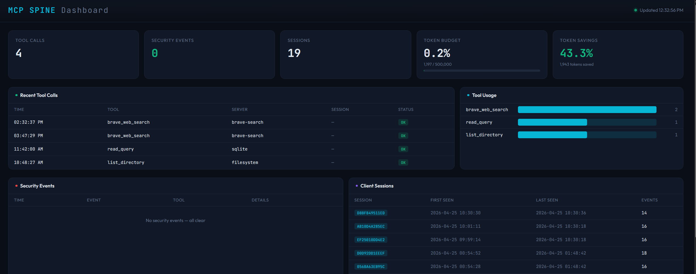

# MCP Spine

[](https://pypi.org/project/mcp-spine/)
[](https://glama.ai/mcp/servers/Donnyb369/mcp-spine)

**The middleware layer MCP is missing.** Security, routing, token control, and compliance — between your LLM and your tools.

MCP Spine is a local-first proxy that sits between Claude Desktop (or any MCP client) and your MCP servers. One config, one entry point, full control over what goes in, what comes out, and what gets logged.

57 tools across 5 servers. One proxy. Zero tokens wasted.

## The Problem

You've connected Claude to GitHub, Slack, your database, your filesystem. Now you have 40+ tools loaded, thousands of tokens burned on schemas every turn, no audit trail, no rate limits, and no way to stop the LLM from reading your boss's DMs. MCP gives agents power. Spine gives you control.

## What It Does

| Layer | What it solves |
|---|---|
| **Security Proxy** | Rate limiting, secret scrubbing, path jails, HMAC audit trail |
| **Semantic Router** | Only relevant tools reach the LLM — local embeddings, no API calls |
| **Schema Minifier** | 61% token savings by stripping unnecessary schema fields |
| **State Guard** | SHA-256 file pins prevent the LLM from editing stale versions |
| **Token Budget** | Daily limits with warn/block enforcement and persistent tracking |
| **Plugin System** | Custom middleware hooks — filter, transform, block per tool |
| **HITL Confirmation** | Destructive tools pause for human approval before executing |
| **Injection Detection** | Scans tool responses for prompt injection before they reach the LLM |
| **Multi-User Audit** | Session-tagged audit trail for shared deployments |
| **Tool Caching** | LRU cache for read-only tools — skip redundant downstream calls |
| **Webhook Alerts** | Slack/Discord/JSON notifications on security events and budget warnings |
| **Web Dashboard** | Browser-based monitoring with live stats, latency tracking, request log |

## Demo


*Runs on Windows, macOS, and Linux. CI tested across all three.*

### Web Dashboard



```bash
mcp-spine web --db spine_audit.db
```

## Install

```bash
pip install mcp-spine

# With semantic routing (optional)
pip install mcp-spine[ml]
```

## Quick Start

```bash
# Interactive setup wizard — detects your servers, asks about features
mcp-spine init

# Or quick default config
mcp-spine init --quick

# Check everything works
mcp-spine doctor --config spine.toml

# Start the proxy
mcp-spine serve --config spine.toml

# Open the web dashboard
mcp-spine web --db spine_audit.db

# Export analytics
mcp-spine export --format csv --hours 24 --output report.csv
```

## Claude Desktop Integration

Replace all your individual MCP server entries with a single Spine entry:

```json
{
  "mcpServers": {
    "spine": {
      "command": "python",
      "args": ["-m", "spine.cli", "serve", "--config", "/path/to/spine.toml"],
      "cwd": "/path/to/mcp-spine"
    }
  }
}
```

## Features

### Security Proxy (Stage 1)
- JSON-RPC message validation and sanitization
- Secret scrubbing (AWS keys, GitHub tokens, bearer tokens, private keys, connection strings)
- Per-tool and global rate limiting with sliding windows
- Path traversal prevention with symlink-aware jail
- Command injection guards for server spawning
- HMAC-fingerprinted SQLite audit trail
- Circuit breakers on failing servers
- Declarative security policies from config

### Semantic Router (Stage 2)
- Local vector embeddings using `all-MiniLM-L6-v2` (no API calls, no data leaves your machine)
- ChromaDB-backed tool indexing
- Query-time routing: only the most relevant tools are sent to the LLM
- `spine_set_context` meta-tool for explicit context switching
- Keyword overlap + recency boost reranking
- Background model loading — tools work immediately, routing activates when ready

### Schema Minification (Stage 3)
- 4 aggression levels (0=off, 1=light, 2=standard, 3=aggressive)
- Level 2 achieves **61% token savings** on tool schemas
- Strips `$schema`, titles, `additionalProperties`, parameter descriptions, defaults
- Preserves all required fields and type information
- Token savings tracked in audit trail and visible in web dashboard

### State Guard (Stage 4)
- Watches project files via `watchfiles`
- Maintains SHA-256 manifest with monotonic versioning
- Injects compact state pins into tool responses
- Prevents LLMs from editing stale file versions

### Human-in-the-Loop
- `require_confirmation` policy flag for destructive tools
- Spine intercepts the call, shows the arguments, and waits for user approval
- `spine_confirm` / `spine_deny` meta-tools for the LLM to relay the decision
- Per-tool granularity via glob patterns

### Tool Output Memory
- Ring buffer caching last 50 tool results
- Deduplication by tool name + argument hash
- TTL expiration (1 hour default)
- `spine_recall` meta-tool to query cached results
- Prevents context loss when semantic router swaps tools between turns

### Token Budget
- Daily token consumption tracking across all tool calls
- Configurable daily limit with warn/block actions
- Per-server token limits for cost control
- Persistent SQLite storage (survives restarts within the same day)
- Automatic midnight rollover
- `spine_budget` meta-tool to check usage mid-conversation

### Plugin System
- Drop-in Python plugins that hook into the tool call pipeline
- Four hook points: `on_tool_call`, `on_tool_response`, `on_tool_list`, `on_startup`/`on_shutdown`
- Plugins can transform arguments, filter responses, block calls, or hide tools
- Plugin chaining — multiple plugins run in sequence
- Allow/deny lists for plugin access control
- Auto-discovery from a configurable plugins directory
- Example included: Slack channel compliance filter

### Prompt Injection Detection
- Scans all tool responses before they reach the LLM
- Detects system prompt overrides, role injection, instruction hijacking, jailbreak attempts
- Detects data exfiltration URLs and encoded payloads
- Configurable action: log, strip, or block
- All detections logged as security events and sent via webhooks

### Tool Aliasing
- Rename tools so the LLM sees cleaner names
- `create_or_update_file` → `edit_github_file`
- Aliases resolved transparently — downstream servers see original names

### Tool Response Caching
- LRU cache for read-only tools (configurable patterns)
- Cache hits skip the downstream call entirely
- TTL-based expiration (5 minutes default)
- Automatic invalidation on cache overflow

### Config Hot-Reload
- Edit `spine.toml` while Spine is running — changes apply in seconds
- Hot-reloadable: minifier level, rate limits, security policies, token budget, state guard patterns
- Non-reloadable (requires restart): server list, commands, audit DB path
- All reloads logged to the audit trail

### Multi-User Audit
- Unique session ID generated per client connection
- Client name and version extracted from MCP handshake
- All audit entries tagged with session ID
- `mcp-spine audit --sessions` lists all client sessions
- `mcp-spine audit --session <id>` filters entries by session

### Webhook Notifications
- POST alerts to Slack, Discord, or any JSON endpoint
- Triggers: security events, budget warnings, budget exceeded, tool blocked, rate limited
- Pre-formatted payloads for Slack blocks and Discord embeds
- Non-blocking (background threads)

### Latency Monitoring
- Tracks response times per server (rolling window)
- Warns when average latency exceeds threshold (default 5s)
- Server latency panel in web dashboard with OK/SLOW status

### Analytics Export
- `mcp-spine export --format csv` or `--format json`
- Filter by hours, event type
- Output to file or stdout for piping

### Transport Support
- **stdio** — local subprocess servers (filesystem, GitHub, SQLite, etc.)
- **SSE** — legacy remote servers over HTTP/Server-Sent Events
- **Streamable HTTP** — MCP 2025-03-26 spec, single-endpoint bidirectional transport with session management
- All transports share the same security, routing, and audit pipeline

### Web Dashboard
- Browser-based monitoring at `localhost:8777`
- Live stat cards: tool calls, security events, sessions, token budget, token savings
- Recent tool calls with server, session, and status
- Tool usage bar chart
- Server latency table with avg/max and OK/SLOW status
- Full request/response log with duration and token counts
- Security events and client sessions tables
- Auto-refresh every 3 seconds
- Zero dependencies (Python stdlib `http.server`)

### Diagnostics

```bash
# Check your setup
mcp-spine doctor --config spine.toml

# Live TUI monitoring
mcp-spine dashboard

# Web dashboard
mcp-spine web --db spine_audit.db

# Usage analytics (includes token budget)
mcp-spine analytics --hours 24

# Export data
mcp-spine export --format csv --hours 168 --output weekly.csv

# Query audit log
mcp-spine audit --last 50
mcp-spine audit --security-only
mcp-spine audit --tool write_file
mcp-spine audit --sessions
mcp-spine audit --session <session-id>
```

## Example Config

```toml
[spine]
log_level = "info"
audit_db = "spine_audit.db"

# Downstream servers — start concurrently
[[servers]]
name = "filesystem"
command = "npx"
args = ["-y", "@modelcontextprotocol/server-filesystem", "/path/to/project"]
timeout_seconds = 120

[[servers]]
name = "github"
command = "npx"
args = ["-y", "@modelcontextprotocol/server-github"]
env = { GITHUB_TOKEN = "ghp_..." }
timeout_seconds = 180

[[servers]]
name = "sqlite"
command = "uvx"
args = ["mcp-server-sqlite", "--db-path", "/path/to/database.db"]
timeout_seconds = 60

[[servers]]
name = "memory"
command = "npx"
args = ["-y", "@modelcontextprotocol/server-memory"]
timeout_seconds = 60

[[servers]]
name = "brave-search"
command = "node"
args = ["/path/to/server-brave-search/dist/index.js"]
env = { BRAVE_API_KEY = "your_key" }
token_limit = 100000  # per-server daily budget
timeout_seconds = 60

# Remote server via Streamable HTTP (MCP 2025-03-26)
# [[servers]]
# name = "remote-api"
# transport = "streamable-http"
# url = "https://your-server.com/mcp"
# headers = { Authorization = "Bearer token" }

# Semantic routing
[routing]
max_tools = 15
rerank = true

# Schema minification — 61% token savings at level 2
[minifier]
level = 2

# Token budget
[token_budget]
daily_limit = 500000
warn_at = 0.8
action = "warn"

# Tool aliasing
[tool_aliases]
enabled = true
aliases = { "create_or_update_file" = "edit_github_file" }

# Tool response caching
[tool_cache]
enabled = true
cacheable_tools = ["read_file", "read_query", "list_directory"]
ttl_seconds = 300

# State guard
[state_guard]
enabled = true
watch_paths = ["/path/to/project"]

# Plugins
[plugins]
enabled = true
directory = "plugins"

# Webhooks
[webhooks]
enabled = true

[[webhooks.hooks]]
url = "https://hooks.slack.com/services/T.../B.../xxx"
events = ["security", "budget_warn"]
format = "slack"

# Human-in-the-loop
[[security.tools]]
pattern = "write_file"
action = "allow"
require_confirmation = true

[[security.tools]]
pattern = "write_query"
action = "allow"
require_confirmation = true

# Security
[security]
scrub_secrets_in_logs = true
audit_all_tool_calls = true
global_rate_limit = 120
per_tool_rate_limit = 60

[security.path]
allowed_roots = ["/path/to/project"]
denied_patterns = ["**/.env", "**/*.key", "**/*.pem"]
```

## Security Model

Defense-in-depth — every layer assumes the others might fail.

| Threat | Mitigation |
|---|---|
| Prompt injection via tool responses | Automated pattern detection (8 categories), log/strip/block |
| Prompt injection via tool args | Input validation, tool name allowlists |
| Path traversal | Symlink-aware jail to `allowed_roots` |
| Secret leakage | Automatic scrubbing of AWS keys, tokens, private keys |
| Runaway agent loops | Per-tool + global rate limiting |
| Command injection | Command allowlist, shell metacharacter blocking |
| Denial of service | Message size limits, circuit breakers |
| Sensitive file access | Deny-list patterns for `.env`, `.key`, `.pem`, `.ssh/` |
| Tool abuse | Policy-based blocking, audit logging, HITL confirmation |
| Log tampering | HMAC fingerprints on every audit entry |
| Destructive operations | `require_confirmation` pauses for user approval |
| Runaway token spend | Daily budget limits with warn/block + per-server limits |
| Unvetted plugins | Allow/deny lists, directory isolation, audit logging |
| Sensitive data exposure | Plugin-based response filtering (e.g., Slack compliance) |
| Server degradation | Latency monitoring with automatic alerts |

## Architecture

```
Client ◄──stdio──► MCP Spine ◄──stdio────────► Filesystem Server
                       │      ◄──stdio────────► GitHub Server
                       │      ◄──stdio────────► SQLite Server
                       │      ◄──stdio────────► Memory Server
                       │      ◄──stdio────────► Brave Search
                       │      ◄──SSE──────────► Legacy Remote
                       │      ◄──Streamable HTTP──► Modern Remote
                   ┌───┴───┐
                   │SecPol │  ← Rate limits, path jail, secret scrub
                   │Inject │  ← Prompt injection detection
                   │Router │  ← Semantic routing (local embeddings)
                   │Minify │  ← Schema compression (61% savings)
                   │Cache  │  ← Tool response caching (LRU + TTL)
                   │Guard  │  ← File state pinning (SHA-256)
                   │HITL   │  ← Human-in-the-loop confirmation
                   │Memory │  ← Tool output cache
                   │Budget │  ← Daily token tracking + limits
                   │Plugin │  ← Custom middleware hooks
                   │Audit  │  ← Session-tagged multi-user trail
                   │Hooks  │  ← Webhook notifications
                   └───────┘
```

### Startup Sequence

1. **Instant handshake** (~2ms) — Responds to `initialize` immediately
2. **Concurrent server startup** — All servers connect in parallel via `asyncio.gather`
3. **Progressive readiness** — Tools available as soon as any server connects
4. **Late server notification** — `tools/listChanged` sent when slow servers finish
5. **Background ML loading** — Semantic router activates silently when model loads

## Windows Support

Battle-tested on Windows with specific hardening for:

- MSIX sandbox paths for Claude Desktop config and logs
- `npx.cmd` resolution via `shutil.which()`
- Paths with spaces (`C:\Users\John Doe\`) and parentheses (`C:\Program Files (x86)\`)
- `PureWindowsPath` for cross-platform basename extraction
- Environment variable merging (config env extends, not replaces, system env)
- UTF-8 encoding without BOM
- Unbuffered stdout (`-u` flag) to prevent pipe hangs

## Project Structure

```
mcp-spine/
├── pyproject.toml
├── spine/
│   ├── cli.py              # CLI: init, serve, verify, audit, dashboard, analytics, doctor, web, export
│   ├── config.py           # TOML config loader with validation
│   ├── proxy.py            # Core proxy event loop
│   ├── protocol.py         # JSON-RPC message handling
│   ├── transport.py        # Server pool, circuit breakers, concurrent startup
│   ├── audit.py            # Structured logging + SQLite audit trail + sessions
│   ├── router.py           # Semantic routing (ChromaDB + sentence-transformers)
│   ├── minifier.py         # Schema pruning (4 aggression levels)
│   ├── state_guard.py      # File watcher + SHA-256 manifest + pin injection
│   ├── memory.py           # Tool output cache (ring buffer + dedup + TTL)
│   ├── budget.py           # Token budget tracker (daily limits + persistence)
│   ├── plugins.py          # Plugin system (hooks, discovery, chaining)
│   ├── injection.py        # Prompt injection detection (8 pattern categories)
│   ├── tool_cache.py       # Tool response caching (LRU + TTL)
│   ├── webhooks.py         # Webhook notifications (Slack, Discord, JSON)
│   ├── dashboard.py        # Live TUI dashboard (Rich)
│   ├── web_dashboard.py    # Browser-based web dashboard
│   ├── sse_client.py       # SSE transport client (legacy)
│   ├── streamable_http.py  # Streamable HTTP transport (MCP 2025-03-26)
│   └── security/
│       ├── secrets.py      # Credential detection & scrubbing
│       ├── paths.py        # Path traversal jail
│       ├── validation.py   # JSON-RPC message validation
│       ├── commands.py     # Server spawn guards
│       ├── rate_limit.py   # Sliding window throttling
│       ├── integrity.py    # SHA-256 + HMAC fingerprints
│       ├── env.py          # Fail-closed env var resolution
│       └── policy.py       # Declarative security policies
├── tests/
│   ├── test_security.py
│   ├── test_config.py
│   ├── test_minifier.py
│   ├── test_state_guard.py
│   ├── test_proxy_features.py
│   ├── test_memory.py
│   ├── test_budget.py
│   └── test_plugins.py
├── examples/
│   └── slack_filter.py     # Example: Slack compliance filter plugin
├── configs/
│   └── example.spine.toml
└── .github/
    └── workflows/
        └── ci.yml
```

## Tests

```bash
pytest tests/ -v
```

190+ tests. CI on Windows + Linux, Python 3.11/3.12/3.13.

## License

MIT
